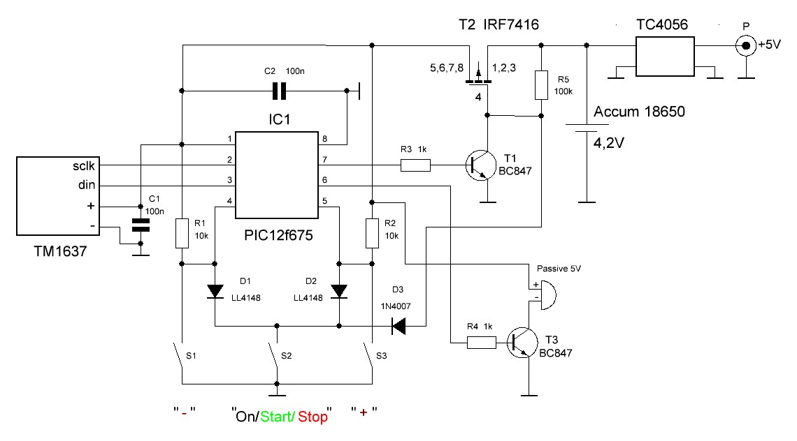

# PIC12F675 Kitchen Timer (5-90 Minutes) with TM1637 Display

A smart, ultra-compact, and energy-efficient DIY kitchen timer designed by **jgl**. 

This project demonstrates how to squeeze a fully functional countdown timer, custom software I2C-like communication protocol, button-debounce logic, 
and deep sleep power-saving features into a tiny 8-pin **PIC12F675** microcontroller with only 1 KB of Flash memory and 64 bytes of RAM.

---

## 🌟 Features

## 🌟 Features

* **Microcontroller:** Microchip PIC12F675 (DIP-8 or SOIC-8).
* **Display Module:** 4-digit 7-segment display driven by the **TM1637** chip (requires only 2 GPIO pins).
* **Time Range:** Adjustable from 5 to 90 minutes with a convenient 5-minute step.
* **Zero Power Consumption:** Unlike standard designs that use software `SLEEP` mode, this circuit physically cuts off its own power supply using a transistor switch when idle, reducing standby current consumption to absolute zero.
* **Hardware Power Control:** A P-channel MOSFET (**IRF7416**) combined with a BC847 bipolar transistor completely isolates the battery from the PIC12F675, TM1637 display, and buzzer, ensuring zero battery drain over months of storage.
* **Battery Powered:** Designed to run off a single **18650 Li-Ion** cell, with an integrated **TC4056** (or TP4056) charging and protection module.
* **Audio Alerts:** Buzzer for loud end-of-countdown notifications.

---

## 🔧 Hardware Configuration & Pinout

Since the PIC12F675 has limited I/O pins, the hardware layout maximizes efficiency:

| PIC12F675 Pin | Function | Connected To |
|---|---|---|
| **VDD** (Pin 1) | Power | +3.7V ... +4.2V (Li-Ion Battery) |
| **GP5** (Pin 2) | Output | Power MOSFET Gate (IRF7416) control |
| **GP4** (Pin 3) | Output | Buzzer control |
| **GP3** (Pin 4) | Input | Reset / Dedicated Button (MCLR) |
| **GP2** (Pin 5) | Input | Control Buttons Matrix |
| **GP1** (Pin 6) | I/O | TM1637 DIO (Data Input/Output) |
| **GP0** (Pin 7) | Output | TM1637 CLK (Clock) |
| **VSS** (Pin 8) | Ground | GND |

---

## 📂 Repository Structure

This repository contains:
* `.hex` - Compiled firmware file, ready to flash into the microcontroller.
* `.lay6, .jpg` - Schematic diagrams and PCB layouts.

### 🖼 Schematic

---

## 🛠 How to Build It

1. **PCB Fabrication:** Use the provided files to etch your own board or order it via any PCB manufacturer.
2. **Flash the MCU:** Use a **PICkit** or any compatible programmer to flash the `.hex` file into the PIC12F675.
3. **Assemble:** Solder the components according to the schematic. Ensure proper polarity for the Li-Ion battery and the TC4056 module.
4. **Enjoy:** Turn it on, set the time, press Start, and never burn your dinner again!

---

## 📜 Author & License

* **Developer:** Yury Glotov (aka **jgl**)
* **Original Publication:** [Datagor.ru](https://datagor.ru) (Russian DIY Electronics Club)

*Feel free to fork this project, report bugs, or submit pull requests!*

--------------------------------------------------------------------------------------------------------------------------------------------------

# Кухонный таймер на PIC12F675 (5-90 минут) с дисплеем TM1637

Умный, ультракомпактный и энергоэффективный DIY кухонный таймер, разработанный **jgl**.

Этот проект наглядно демонстрирует, как уместить полноценный таймер обратного отсчета, программную реализацию I2C-подобного протокола связи, 
логику антидребезга контактов кнопок и режим глубокого энергосбережения в крошечный 8-выводной микроконтроллер **PIC12F675**, имеющий всего 1 КБ флеш-памяти и 64 байта ОЗУ.

---

## 🌟 Особенности проекта

## 🌟 Особенности проекта

* **Микроконтроллер:** Microchip PIC12F675 (в корпусе DIP-8 или SOIC-8).
* **Модуль дисплея:** 4-разрядный 7-сегментный индикатор на базе чипа **TM1637** (управляется всего по 2 выводам GPIO).
* **Диапазон времени:** Настройка от 5 до 90 минут с удобным шагом в 5 минут.
* **Абсолютно нулевое потребление в режиме ожидания:** В отличие от классических схем, где микроконтроллер уходит в программный режим сна (`SLEEP`), данное устройство физически полностью обесточивает само себя с помощью транзисторного ключа, снижая ток потребления до абсолютного нуля.
* **Аппаратное управление питанием:** Связка из P-канального полевого транзистора (**IRF7416**) и биполярного BC847 полностью отключает аккумулятор от микроконтроллера PIC12F675, дисплея TM1637 и зуммера, исключая саморазряд батареи при хранении.
* **Питание от аккумулятора:** Устройство работает от одного литий-ионного элемента типа **18650** со встроенным модулем зарядки и защиты на базе **TC4056** (или TP4056).
* **Звуковое оповещение:** Зуммер для громкого уведомления об окончании отсчета.

---

## 🔧 Аппаратная конфигурация и распиновка

Поскольку PIC12F675 имеет ограниченное количество выводов, схема спроектирована максимально эффективно:

| Вывод PIC12F675 | Функция | К чему подключен |
|---|---|---|
| **VDD** (Вывод 1) | Питание | +3.7V ... +4.2V (Li-Ion аккумулятор) |
| **GP5** (Вывод 2) | Выход | Управление затвором полевого транзистора (IRF7416) |
| **GP4** (Вывод 3) | Выход | Управление активным зуммером |
| **GP3** (Вывод 4) | Вход | Сброс (MCLR) / Выделенная кнопка |
| **GP2** (Вывод 5) | Вход | Матрица кнопок управления |
| **GP1** (Вывод 6) | Ввод/Вывод | Линия данных TM1637 DIO |
| **GP0** (Вывод 7) | Выход | Линия тактирования TM1637 CLK |
| **VSS** (Вывод 8) | Земля | Общий провод (GND) |

---

## 📂 Структура репозитория

В репозитории содержатся следующие материалы:
* `.hex` — Готовый к заливке в микроконтроллер скомпилированный файл прошивки.
* `.lay6, .jpg` — Принципиальные схемы и трассировка печатных плат.

### 🖼 Schematic

---

## 🛠 Инструкция по сборке

1. **Изготовление платы:** Используйте файлы из папки `Hardware/` для самостоятельного травления платы (ЛУТ/фоторезист) или отправки Gerber-файлов на завод.
2. **Прошивка МК:** Используйте программатор **PICkit** или любой другой совместимый инструмент для заливки файла `.hex` в микроконтроллер PIC12F675.
3. **Монтаж:** Спаяйте компоненты согласно схеме. Обратите особое внимание на полярность подключения Li-Ion аккумулятора и модуля TC4056.
4. **Готово:** Включайте, выставляйте время, нажимайте «Старт» и больше никогда не беспокойтесь о подгоревшем ужине!

---

## 📜 Авторство и Лицензия

* **Разработчик:** Юрий Глотов (aka **jgl**)
* **Первоисточник публикации:** Клуб радиолюбителей [Datagor.ru](https://datagor.ru)

*Вы можете свободно делать форки этого проекта, сообщать об ошибках или предлагать свои улучшения через Pull Requests!*

